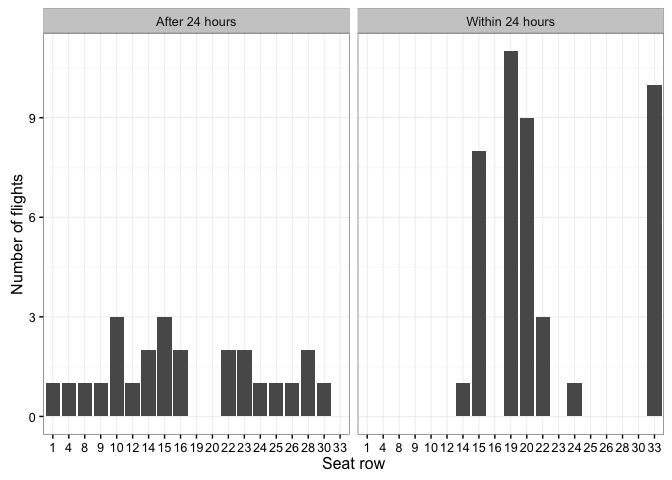

# How to avoid middle seats when flying with Ryanair for free?

I often fly with Ryanair and I really don't like sitting in the middle seat when doing so. Avoiding these seats used to be quite easy until a couple of years ago when Ryanair started to *randomly* assign seats at the time of check-in. After that, it seemed that the only way to avoid middle seats for sure was to pay an extra 6 GBP/EUR fee to select your own seat. But what if you don't really care about the exact place where you are sitting and you just want to reduce the chance of sitting in the middle? If the seats are allocated completely at random then your chances of ending up at a middle seat should be approximately 1/3. However, what if the random seat allocation is actually not completely random? 

Some time ago I noticed that when I did my check-in on the first day after it opened.

Check-in time      Number of flights   Number of middle seats    Fraction
----------------  ------------------  -----------------------  ----------
After 24 hours                    17                        8   0.4705882
Within 24 hours                   29                        1   0.0344828

 
